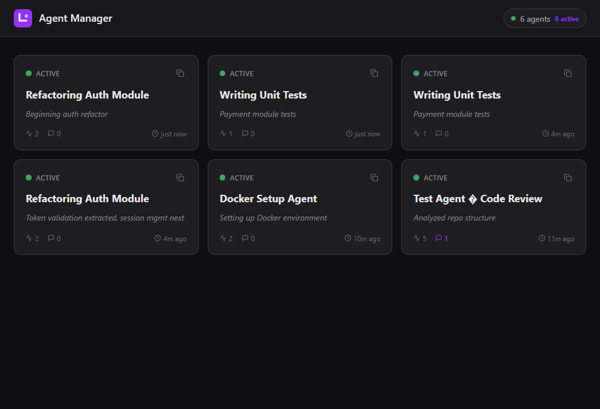
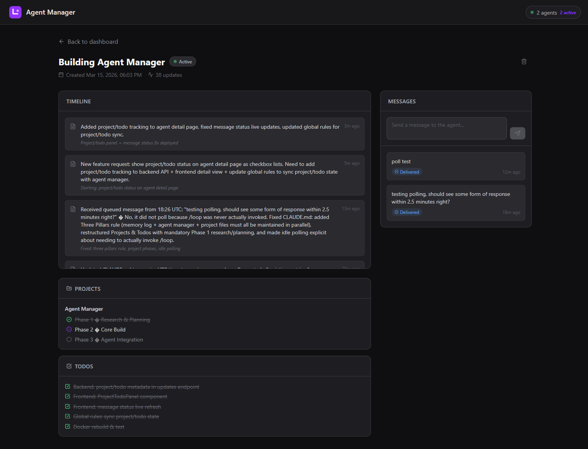

# Claude Agent Manager

A self-hosted dashboard for monitoring, communicating with, and launching Claude Code agents in real time. Track progress, send instructions, receive status updates, launch new agents, resume sessions, and download generated artefacts — all from a single web interface accessible from anywhere via Tailscale.




## Features

- **Real-time agent monitoring** — see what every Claude agent is working on, with live updates via SSE
- **Two-way messaging** — send instructions to agents from the dashboard; agents poll and act on them automatically
- **Launch agents from the dashboard** — click "New Agent", pick a folder, and a Claude terminal session spawns on the host machine
- **Resume sessions** — hit the Resume button on any agent to relaunch its Claude session with full conversation history
- **Project & todo tracking** — agents report project phases and todo completion, displayed as interactive panels
- **File & artefact management** — upload files to agents, download artefacts generated by Claude
- **PDF report export** — generate branded PDF reports of agent activity via PrintingPress
- **Polling control** — pause and resume agent polling remotely with automatic restart scheduling
- **Remote access via Tailscale** — access the dashboard from your phone on any network (see [Remote Access](#remote-access-via-tailscale))
- **Mobile-friendly** — responsive layout optimised for phones and tablets
- **Bootstrap endpoint** — fresh Claude sessions self-configure by fetching a single URL
- **Archive/unarchive** — shelve inactive agents without deleting them

## Tech Stack

| Component | Technology | Port |
|-----------|-----------|------|
| Frontend | React 18 + TypeScript + Tailwind CSS | 8080 (Nginx) |
| Backend | Express.js + TypeScript + better-sqlite3 | 3001 |
| PDF Generator | Python + FastAPI + WeasyPrint | 8090 |
| Host Launcher | Node.js (runs on Windows host) | — |
| Database | SQLite (WAL mode) in Docker volume | — |
| Real-time | Server-Sent Events (SSE) | — |

## Quick Start

### Prerequisites

- Docker Desktop installed and running
- Git
- Node.js (for the host launcher)
- ~2GB free disk space

### Deploy

```bash
git clone https://github.com/Alex-ReachIndustries/ClaudeAgentManager.git
cd ClaudeAgentManager
docker compose up -d --build
```

Verify: `curl http://localhost:8080/api/health` → `{"status":"ok"}`

Open the dashboard: [http://localhost:8080](http://localhost:8080)

### Start the Host Launcher

The launcher runs on the Windows host (not in Docker) and handles spawning Claude terminal sessions when you click "New Agent" or "Resume" in the dashboard:

```bash
cd launcher
node launcher.js
```

To run it in the background:

```powershell
Start-Process -FilePath 'node' -ArgumentList 'launcher\launcher.js' -WindowStyle Hidden
```

### Connect Claude

The fastest way to connect a Claude Code session:

```
Fetch http://<your-server>:8080/api/agents/bootstrap and follow the setup instructions to connect to the Agent Manager.
```

Or manually:

1. Save the server URL:
   ```bash
   echo 'http://localhost:8080' > ~/.claude/agent-server-url
   ```

2. Create skill files at `~/.claude/commands/session-init.md` and `~/.claude/commands/agent-checkin.md` (content provided by the bootstrap endpoint)

3. Add the mandatory session protocol to `~/.claude/CLAUDE.md`

4. Run `/session-init` in the Claude session

## Remote Access via Tailscale

Access the Agent Manager dashboard from your phone or any device on any network using [Tailscale](https://tailscale.com/) — a free mesh VPN.

### Why Tailscale?

- **Free** for personal use (up to 100 devices)
- **No port forwarding** — works through NAT and firewalls
- **Peer-to-peer** — your traffic goes directly between devices, not through Tailscale's servers
- **Always on** — runs as a system service, starts on boot
- **MagicDNS** — access your machine by hostname (e.g. `http://msi:8080`) instead of IP

### Setup

1. **Install Tailscale on your computer:**
   ```
   winget install Tailscale.Tailscale
   ```
   Or download from [tailscale.com/download](https://tailscale.com/download)

2. **Install Tailscale on your phone** from the App Store / Play Store

3. **Sign in to both devices** with the same account (Google, GitHub, etc.)

4. **Access the dashboard** from your phone at:
   ```
   http://<your-tailscale-hostname>:8080
   ```
   Find your hostname with `tailscale status` — it'll show something like `100.x.y.z  msi`. With MagicDNS enabled (default), you can use `http://msi:8080`.

### Verify

```bash
# Check Tailscale is running and see your IP
tailscale status

# Check MagicDNS is enabled
tailscale dns status
```

Both devices keep full internet access — Tailscale only routes traffic between your own devices through its VPN, everything else goes through your normal connection.

## API Reference

| Method | Endpoint | Description |
|--------|----------|-------------|
| GET | `/api/health` | Health check |
| GET | `/api/agents` | List all agents |
| GET | `/api/agents/bootstrap` | Setup instructions for fresh Claude |
| GET | `/api/agents/:id` | Get single agent |
| POST | `/api/agents/:id/updates` | Post an update (auto-creates agent) |
| GET | `/api/agents/:id/updates` | Get all updates |
| POST | `/api/agents/:id/messages` | Queue a message for the agent |
| GET | `/api/agents/:id/messages` | Get messages (`?status=pending&deliver=true`) |
| POST | `/api/agents/:id/read` | Mark agent as read |
| POST | `/api/agents/:id/files` | Upload file (multipart) |
| GET | `/api/agents/:id/files` | List files |
| GET | `/api/agents/:id/files/:fileId` | Download file |
| GET | `/api/agents/:id/export/pdf` | Generate PDF report |
| PATCH | `/api/agents/:id` | Update agent fields |
| DELETE | `/api/agents/:id` | Delete agent |
| GET | `/api/events` | SSE event stream |
| GET | `/api/folders` | Browse folders (`?path=relative/path`) |
| POST | `/api/launch-requests` | Request agent launch (`{type, folder_path}`) |
| GET | `/api/launch-requests` | List launch requests (`?status=pending`) |
| PATCH | `/api/launch-requests/:id` | Update launch request status |

## Data Persistence

The SQLite database is stored in a Docker named volume (`agent-data`). It persists across container restarts and rebuilds.

Backup: `docker cp claudemanager-backend-1:/app/data/agents.db ./backup.db`

## PDF Generation

PDF reports are generated via a PrintingPress-based service. The PDF generator requires the [PrintingPress](https://github.com/Alex-ReachIndustries/PrintingPress) repository mounted at `/c/Users/kuron/Documents/PrintingPress` (configurable in `docker-compose.yml`). If you don't need PDF export, the service can be removed from docker-compose without affecting other functionality.

## Documentation

See [docs/Agent_Manager_Manual.pdf](docs/Agent_Manager_Manual.pdf) for the comprehensive reference manual with architecture diagrams, deployment guide, and full API documentation.

## License

MIT
