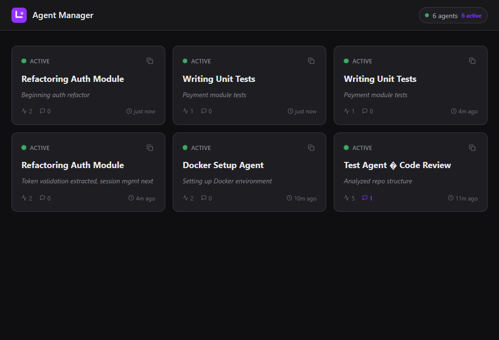
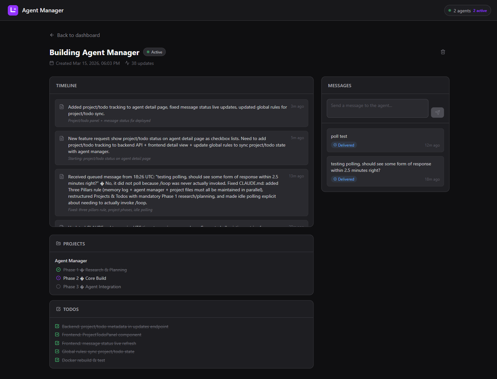

# Claude Agent Manager

A self-hosted dashboard for monitoring, communicating with, and launching Claude Code agents in real time. Track progress, send instructions, receive status updates, launch new agents, resume sessions, and download generated artefacts — all from a single web interface accessible from anywhere via Tailscale.




## Features

- **Real-time agent monitoring** — see what every Claude agent is working on, with live updates via SSE
- **Two-way messaging** — send instructions to agents from the dashboard; agents poll and act on them automatically
- **Launch agents from the dashboard** — click "New Agent", pick a folder and assign a role/task, and a Claude terminal session spawns on the host machine
- **Resume sessions** — hit the Resume button on any agent to relaunch its Claude session with full conversation history
- **Multi-agent projects** — create projects with a PM agent that spawns, coordinates, and monitors sub-agents automatically
- **Project controls** — pause/resume projects; pause notifies all active agents and prevents new launches
- **Agent effort & model limits** — per-project caps on agent model (haiku/sonnet/opus) and effort level
- **Project & todo tracking** — agents report project phases and todo completion, displayed as interactive panels
- **Agent-to-agent relay** — agents send structured messages to each other via the relay API; displayed in timeline
- **File & artefact management** — upload files to agents, download artefacts generated by Claude
- **Per-agent cost tracking** — track token spend per agent with a breakdown panel
- **PDF report export** — generate branded PDF reports of agent activity via PrintingPress
- **Polling control** — pause and resume agent polling remotely with automatic restart scheduling
- **Remote access via Tailscale** — access the dashboard from your phone on any network (see [Remote Access](#remote-access-via-tailscale))
- **Android app** — native Android companion app with full feature parity, SSE live updates, and file management
- **Mobile-friendly** — responsive layout optimised for phones and tablets
- **Bootstrap endpoint** — fresh Claude sessions self-configure by fetching a single URL
- **Archive/unarchive** — shelve inactive agents without deleting them

## Tech Stack

| Component | Technology | Port |
|-----------|-----------|------|
| Frontend | React 18 + TypeScript + Tailwind CSS | 8080 (Nginx) |
| Backend | Express.js + TypeScript + better-sqlite3 | 3001 |
| PDF Generator | Python + FastAPI + WeasyPrint | 8090 |
| Host Launcher | Node.js (runs on Windows host) | — |
| Database | SQLite (WAL mode) in Docker volume | — |
| Real-time | Server-Sent Events (SSE) | — |

## Quick Start

### Prerequisites

To **run agents** (a host machine that launches/resumes Claude sessions):

- Docker Desktop installed and running — runs the dashboard + backend
- Node.js (for the host launcher)
- **Claude Code CLI — installed *and* signed in.** This is **separate from Docker**: the agents you launch *are* Claude Code sessions the launcher spawns on the host, so Docker does not include it. Install with `npm install -g @anthropic-ai/claude-code` (or see the [Claude Code docs](https://docs.claude.com/en/docs/claude-code)) and run `claude` once to log in.
- Git
- ~2GB free disk space

To **only view/message agents** (e.g. from your phone), you need nothing but a web browser + Tailscale — see [Remote Access](#remote-access-via-tailscale).

### One-command setup (recommended)

On a **fresh machine**, the turnkey installer does everything below for you — installs Docker, Node, Claude Code and Git, brings the stack up, prints your API key, and walks the login + optional Tailscale:

```bash
# Linux (Debian/Ubuntu)
curl -fsSL https://raw.githubusercontent.com/Alex-ReachIndustries/ClaudeAgentManager/main/setup/install-linux.sh | bash
# macOS
curl -fsSL https://raw.githubusercontent.com/Alex-ReachIndustries/ClaudeAgentManager/main/setup/install-mac.sh | bash
```
```powershell
# Windows (PowerShell) — download then run so you can review it first
irm https://raw.githubusercontent.com/Alex-ReachIndustries/ClaudeAgentManager/main/setup/install-windows.ps1 -OutFile install-windows.ps1
powershell -ExecutionPolicy Bypass -File .\install-windows.ps1
```
Each installer is idempotent and supports `--dry-run` (`-DryRun` on Windows) to preview every action. Prefer the manual steps? Continue below.

### Deploy (manual)

```bash
git clone https://github.com/Alex-ReachIndustries/ClaudeAgentManager.git
cd ClaudeAgentManager
docker compose up -d --build
```

Verify: `curl http://localhost:8080/api/health` → `{"status":"ok"}`

Open the dashboard: [http://localhost:8080](http://localhost:8080) (or your Tailscale URL if configured)

### Start the Host Launcher

The launcher runs on the Windows host (not in Docker) and handles spawning Claude terminal sessions when you click "New Agent" or "Resume" in the dashboard:

```bash
cd launcher
node launcher.js
```

To run it in the background:

```powershell
Start-Process -FilePath 'node' -ArgumentList 'launcher\launcher.js' -WindowStyle Hidden
```

### Connect Claude

The fastest way to connect a Claude Code session:

```
Fetch http://<your-server>:8080/api/agents/bootstrap and follow the setup instructions to connect to the Agent Manager.
```

Or manually:

1. Save the server URL:
   ```bash
   echo 'http://localhost:8080' > ~/.claude/agent-server-url  # or your Tailscale URL
   ```

2. Create skill files at `~/.claude/commands/session-init.md` and `~/.claude/commands/agent-checkin.md` (content provided by the bootstrap endpoint)

3. Add the mandatory session protocol to `~/.claude/CLAUDE.md`

4. Run `/session-init` in the Claude session

## Remote Access via Tailscale

Access the Agent Manager dashboard from your phone or any device on any network using [Tailscale](https://tailscale.com/) — a free mesh VPN.

### Why Tailscale?

- **Free** for personal use (up to 100 devices)
- **No port forwarding** — works through NAT and firewalls
- **Peer-to-peer** — your traffic goes directly between devices, not through Tailscale's servers
- **Always on** — runs as a system service, starts on boot
- **MagicDNS** — access your machine by hostname (e.g. `https://your-host.tailnet.ts.net`) instead of IP
- **HTTPS** — `tailscale serve` provides trusted TLS certificates automatically

### Setup

1. **Install Tailscale on your computer:**
   ```
   winget install Tailscale.Tailscale
   ```
   Or download from [tailscale.com/download](https://tailscale.com/download)

2. **Install Tailscale on your phone** from the App Store / Play Store

3. **Sign in to both devices with the SAME account — use a PERSONAL email, NOT a `reach.industries` email.** A reach.industries login places you on a different, org-managed tailnet where the devices won't see each other; a personal account (personal email / Google / GitHub) keeps the server and your phone on one tailnet so they connect.

4. **Enable HTTPS** in the [Tailscale admin console](https://login.tailscale.com/admin/dns) under DNS settings

5. **Start Tailscale Serve** to proxy HTTPS to the local Docker frontend:
   ```bash
   tailscale serve --bg 8080
   ```

6. **Access the dashboard** from your phone at:
   ```
   https://<your-tailscale-hostname>.<your-tailnet>.ts.net
   ```
   Find your hostname and tailnet with `tailscale status`. Tailscale Serve provides trusted Let's Encrypt TLS certificates automatically.

### Verify

```bash
# Check Tailscale is running and see your IP
tailscale status

# Check MagicDNS is enabled
tailscale dns status
```

Both devices keep full internet access — Tailscale only routes traffic between your own devices through its VPN, everything else goes through your normal connection.

## API Reference

| Method | Endpoint | Description |
|--------|----------|-------------|
| GET | `/api/health` | Health check |
| GET | `/api/agents` | List all agents |
| GET | `/api/agents/bootstrap` | Setup instructions for fresh Claude |
| GET | `/api/agents/:id` | Get single agent |
| POST | `/api/agents/:id/updates` | Post an update (auto-creates agent) |
| GET | `/api/agents/:id/updates` | Get all updates |
| POST | `/api/agents/:id/messages` | Queue a message for the agent |
| GET | `/api/agents/:id/messages` | Get messages (`?status=pending&deliver=true`) |
| POST | `/api/agents/:id/read` | Mark agent as read |
| POST | `/api/agents/:id/files` | Upload file (multipart) |
| GET | `/api/agents/:id/files` | List files |
| GET | `/api/agents/:id/files/:fileId` | Download file |
| GET | `/api/agents/:id/export/pdf` | Generate PDF report |
| PATCH | `/api/agents/:id` | Update agent fields |
| DELETE | `/api/agents/:id` | Delete agent |
| GET | `/api/events` | SSE event stream |
| GET | `/api/folders` | Browse folders (`?path=relative/path`) |
| POST | `/api/launch-requests` | Request agent launch (`{type, folder_path, spawn_meta}`) |
| GET | `/api/launch-requests` | List launch requests (`?status=pending`) |
| PATCH | `/api/launch-requests/:id` | Update launch request status |
| GET | `/api/agents/:id/costs` | Get per-agent cost breakdown |
| POST | `/api/agents/:id/relay` | Send a message to another agent |
| GET | `/api/projects` | List all projects |
| POST | `/api/projects` | Create a project |
| GET | `/api/projects/:id` | Get project details |
| PATCH | `/api/projects/:id` | Update project |
| DELETE | `/api/projects/:id` | Delete project |
| POST | `/api/projects/:id/start` | Start or unpause a project (user only) |
| POST | `/api/projects/:id/pause` | Pause a project, notify all active agents |
| GET | `/api/projects/:id/agents` | List agents belonging to a project |
| POST | `/api/projects/:id/updates` | Post a project timeline update |
| GET | `/api/projects/:id/updates` | Get project timeline |

## Data Persistence

The SQLite database is stored in a Docker named volume (`agent-data`). It persists across container restarts and rebuilds.

Backup: `docker cp claudemanager-backend-1:/app/data/agents.db ./backup.db`

## PDF Generation

PDF reports are generated via a PrintingPress-based service. The PDF generator requires the [PrintingPress](https://github.com/Alex-ReachIndustries/PrintingPress) repository cloned locally. Set the `PRINTINGPRESS_PATH` variable in your `.env` file to point to it. If you don't need PDF export, the service can be removed from docker-compose without affecting other functionality.

## Documentation

- **[docs/setup-all-platforms.md](docs/setup-all-platforms.md)** — set up and run the Manager on **Windows, macOS, or Linux**, plus remote access via Tailscale (incl. the personal-email requirement) and how to reach the UI from an iPhone.
- **Non-technical user guide** — a friendly walkthrough for non-technical users (Windows + iPhone), attached to the latest GitHub release / shared as a PDF.
- **[docs/ClaudeManager_v4.0.0_User_Manual.pdf](docs/ClaudeManager_v4.0.0_User_Manual.pdf)** — the older comprehensive v4 reference manual (multi-agent projects, relay messaging, cost tracking, Android app, API reference).

### Recent developments (v7)

- **Knowledge Hub** — a shared, searchable knowledge base (`/api/kb/*`) the agents consult and contribute to: semantic + keyword hybrid search, an approval queue, people profiles, a nested category tree, proactive retrieval (relevant entries auto-surfaced on task delivery), a **knowledge-wanted** backlog for gaps, and an **Insights** analytics view (usage, hit rate, gaps, surface→open, per-agent).
- **Context hygiene** — agents compact-on-idle and write pointer-only summaries, re-fetching detail from the KB on demand.
- **Model tiers** — the launcher resolves the `opus`/`sonnet` families to the current latest (Opus 5 / Sonnet 5) centrally.

## License

MIT
